# Лабораторная работа: Основы работы с Docker

## Цель работы

Данная лабораторная работа призвана напомнить основные команды ОС Debian/Ubuntu. Также она позволяет познакомиться с Docker и его основными командами.

## Задание

Запускаю контейнер Ubuntu, устаанавливаю Web-сервер Apache и вывожу в браузере страницу с текстом "Hello, World!".

## Подготовка

Для выполнения данной работы необходимо иметь установленный на компьютере Docker.

## Выполнение

### 1. Создание репозитория

1. Создаю репозиторий `containers04` на GitHub и склонируйте его себе на компьютер:
   ```sh
   git clone https://github.com/tasea14/containers04
   cd containers04
   ```

   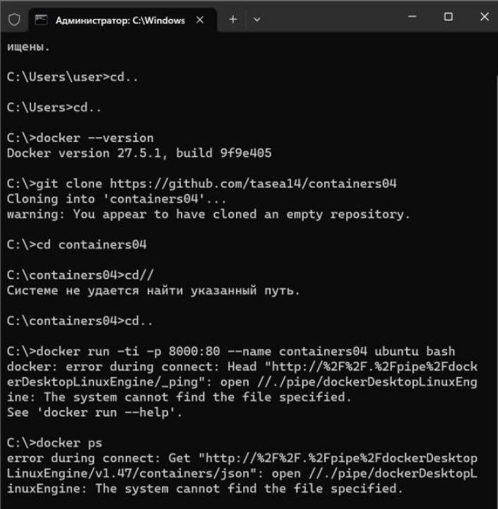

2. Создайте файл `README.md` и зафиксируйте его в репозитории:
   ```sh
   echo "# Лабораторная работа" > README.md
   git add README.md
   git commit -m "Создан README.md"
   git push origin main
   ```
   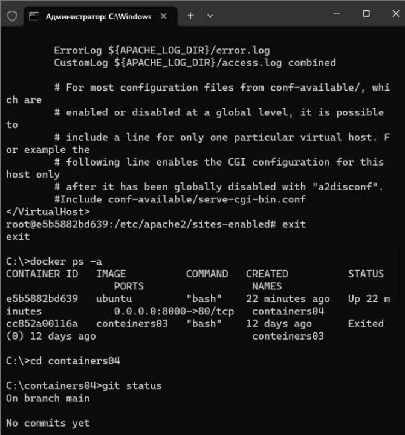


### 2. Запуск контейнера Ubuntu

Открываю терминал в папке `containers04` и выполните команду:
```sh
docker run -ti -p 8000:80 --name containers04 ubuntu bash
```

   

### 3. Установка Apache и запуск сервера

Внутри контейнера выполняю следующие команды:
```sh
apt update
apt install apache2 -y
service apache2 start
```

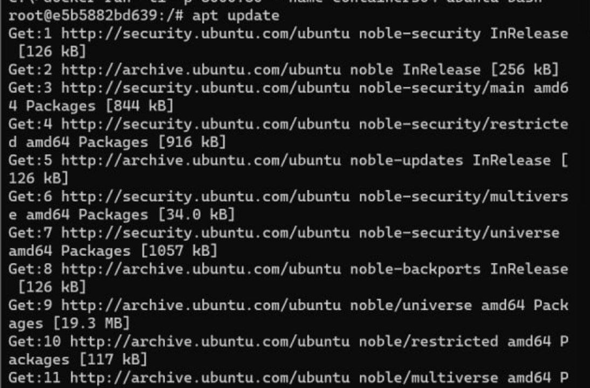
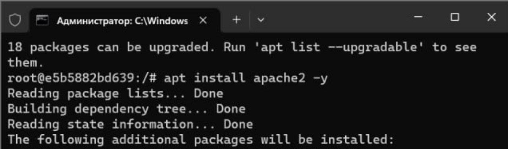
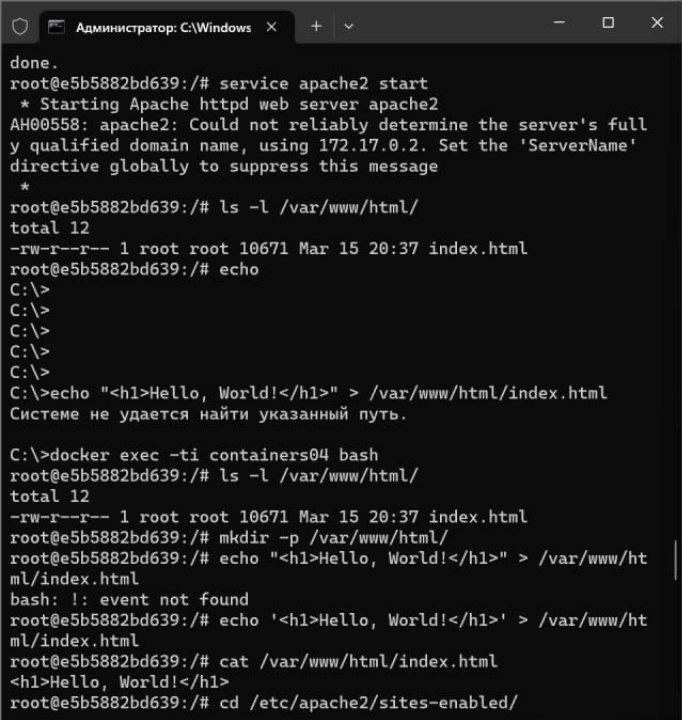
### 4. Проверка работы сервера

Откройте браузер и введите в адресной строке `http://localhost:8000`.
*Что вы видите?*

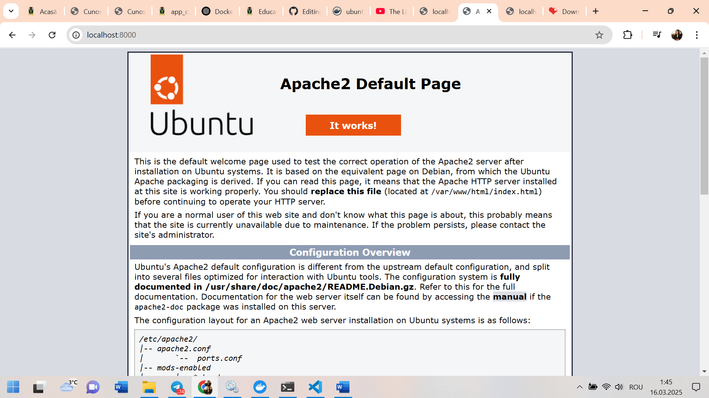
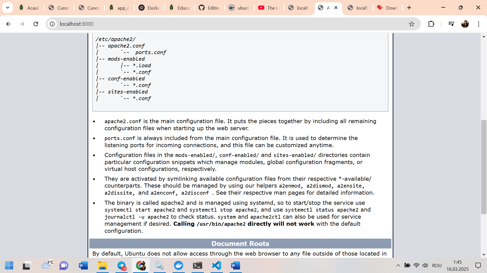
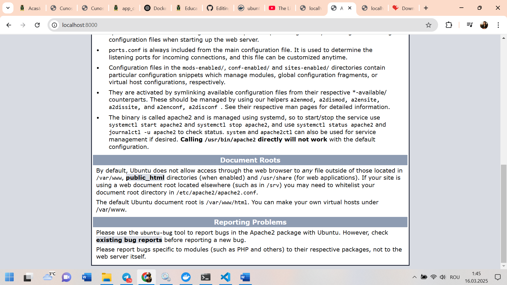

### 5. Создание и изменение страницы

Выполните команды:
```sh
ls -l /var/www/html/
echo '<h1>Hello, World!</h1>' > /var/www/html/index.html
```
Обновите страницу в браузере. *Что вы видите?*

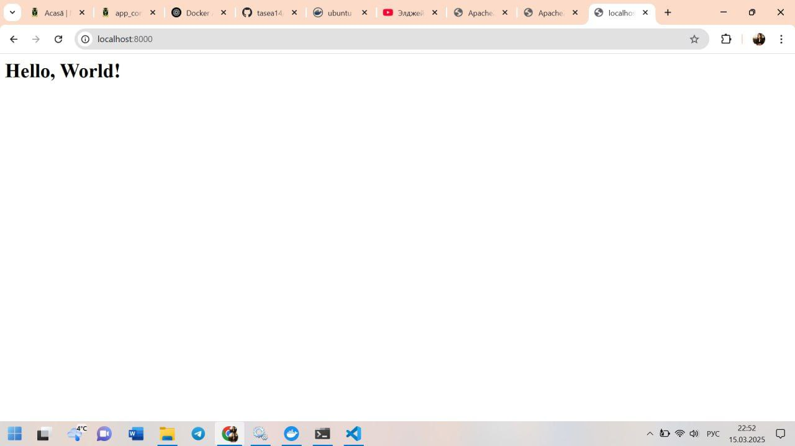

### 6. Проверка конфигурации Apache

```sh
cd /etc/apache2/sites-enabled/
cat 000-default.conf
```
*Что вы видите на экране?*

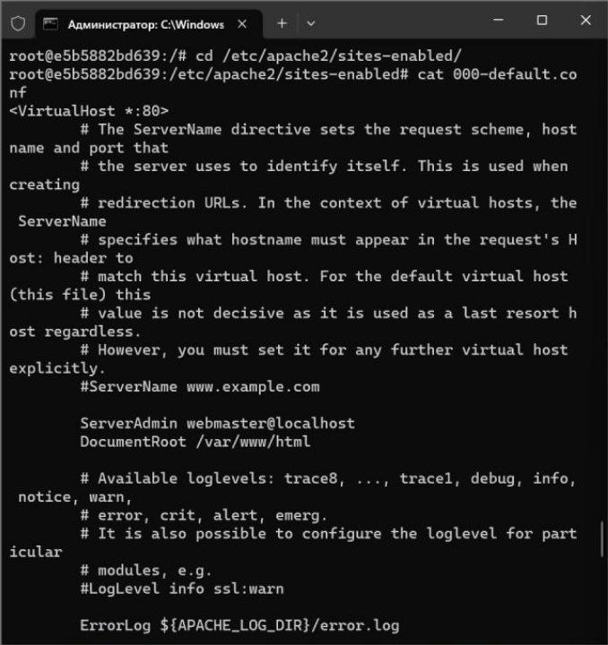

### 7. Остановка и удаление контейнера

Закройте окно терминала командой:
```sh
exit
```
Просмотрите список контейнеров:
```sh
docker ps -a
```
Удалите контейнер:
```sh
docker rm containers04
```
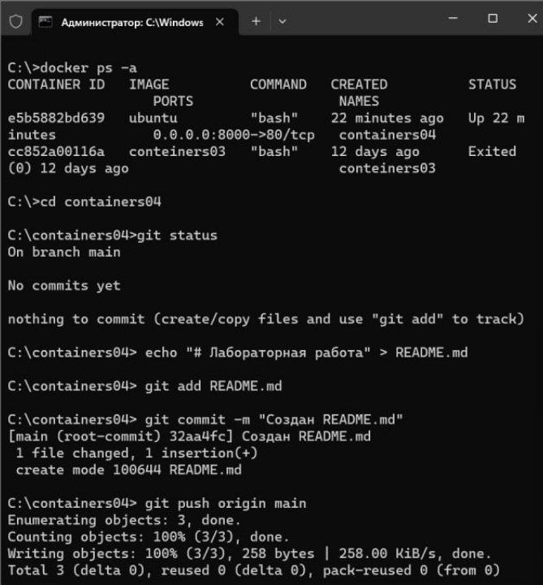


## Выводы

В рамках лабораторной работы были изучены базовые команды для работы с Docker, установка веб-сервера Apache в контейнере Ubuntu и настройка его работы. Также был выполнен вывод веб-страницы с пользовательским текстом в браузере.

## Используемые источники

- [Официальная документация Docker](https://docs.docker.com/)
- [Docker Hub](https://hub.docker.com/)


